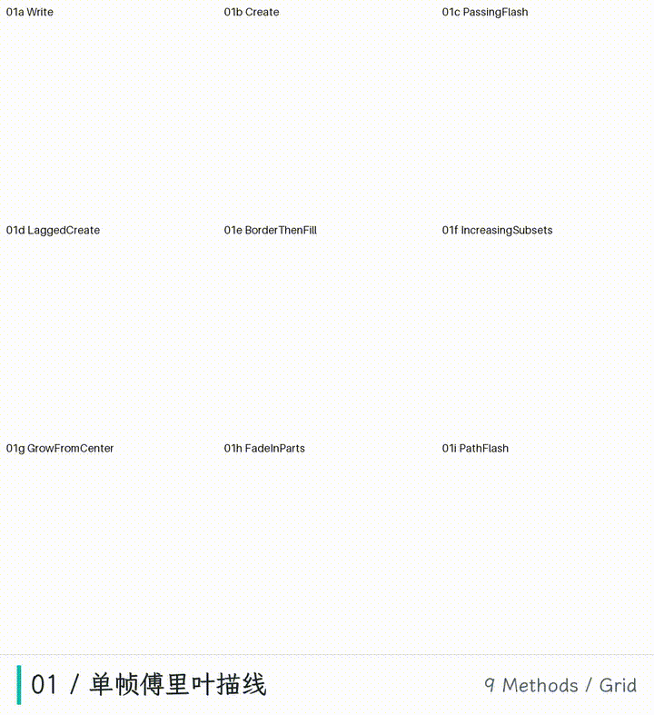
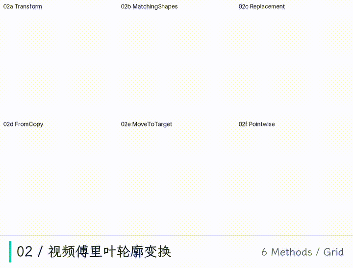
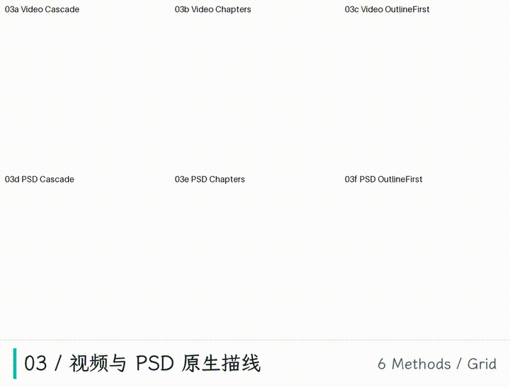

# 🎞️ lvend-ruantang-fourier-manim

> [▶️ 点击跳转原始素材视频](https://www.bilibili.com/video/BV1y7QwBgEHc) [](https://www.bilibili.com/video/BV1y7QwBgEHc)

本仓库将一张动画中间帧、视频采样帧与 PSD 分层姿态转成几何轮廓，并用 Manim 重现线稿绘制、傅里叶平滑和姿态展示动画。

`output/` 按版本整理成品：`output/no_captioned/` 是 01-03 直接渲染的本地无字幕原版，已被 Git 忽略；`output/captioned/` 是在不改变原动画的前提下增加底部说明栏的提交版。所有文件名前的 `01_`、`02_`、`03_` 分别对应下列源码实验。

## 🧰 环境

只需要 Python、[uv](https://docs.astral.sh/uv/) 和系统可执行的 `ffmpeg`。按系统安装 FFmpeg：

```powershell
# Windows (Scoop)
scoop install ffmpeg
```

```bash
# Debian / Ubuntu
sudo apt update && sudo apt install ffmpeg

# Fedora / Red Hat 系
sudo dnf install ffmpeg

# Arch Linux
sudo pacman -S ffmpeg
```

```bash
# macOS
brew install ffmpeg
```

安装后确认 `ffmpeg -version` 可运行。

```powershell
git clone https://github.com/VincentZyu233/lvend-ruantang-fourier-manim.git
cd lvend-ruantang-fourier-manim
uv venv --python 3.13
uv sync
uv run python -c "import manim, cv2, psd_tools; print(manim.__version__)"
```

素材 `素材捏/略ndoc的软糖动画/` 已在仓库中：`midpoint.png` 用于 01，`某种软糖.mp4` 用于 02/03 的视频姿态，`1775818328351.psd` 用于 03 的 PSD 姿态。因此 clone 后不需要再下载项目素材。

## ▶️ 复现

以下命令会覆盖 `output/no_captioned/` 中对应编号的单片、MP4/GIF 和 grid。Manim 的中间帧与提取数据写入被忽略的 `build/`，不会污染 Git。

```powershell
uv run python src/01/render.py
uv run python src/02/render.py
uv run python src/03/render.py
```

渲染质量与已提交成品一致：单片为 720x720、20 FPS；01 的 grid 为 1080x1080，02/03 的 grid 为 1080x720。完整生成需要一些时间，尤其是 02 的高采样傅里叶曲线。

字幕包装不重渲染 Manim scene，而是从上面的原始产物生成独立版本。安装 [霞鹜文楷](https://github.com/lxgw/LxgwWenKai) 后传入 Medium 字体文件路径：

```powershell
uv run python src/captioned/render.py --font "<LXGWWenKai-Medium.ttf 的绝对路径>"
```

增加 `--bili` 会同时在被忽略的 `output/bili/` 生成配乐成片。该成片依赖本地 BGM 文件，默认路径为 `output/music/哀の隙間-mimi.flac`。

## 🗂️ 源码索引

所有脚本从项目根目录运行，使用 `uv run python src/0x/render.py`。

| 目录 | 输入 | 单片 | Grid | 核心方法 |
| --- | --- | --- | --- | --- |
| `src/01/` | `midpoint.png` | 9 种线稿出现效果 | 3x3 | 阈值轮廓、K-means 色块、单条轮廓的 DFT 重建 |
| `src/02/` | `某种软糖.mp4` | 6 种姿态变换效果 | 3x2 | 五帧采样、轮廓重采样、FFT 平滑、Manim 变换 |
| `src/03/` | 视频和 `1775818328351.psd` | 6 种描线姿态展示 | 3x2 | 原生 `Create`、onion skin、PSD 图层组轮廓 |
| `src/captioned/` | `output/no_captioned/` 原始成片 | 21 段单片 | 3 个 grid | 霞鹜文楷底部说明栏、FFmpeg 成片拼接 |

01-03 的每个 `render.py` 都将自己的 scene 输出到 `output/no_captioned/`，用 `ffmpeg` 同时制作 GIF 和 grid；`src/captioned/render.py` 再将它们包装为带字幕版本。若只想调试某一个 scene，可直接调用 Manim，例如：

```powershell
uv run manim src/02/video_transform.py VideoFourierSmoothTransform -pql
```

## 🖼️ Grid 对比

### 1️⃣ 静帧线稿出现效果

#### 🅰️ Write




### 2️⃣ 视频傅里叶轮廓变换

#### 🅰️ Transform




### 3️⃣ 视频与 PSD 的原生 Create 展示

#### 🅰️ Video Single




更多已提交的字幕版 MP4/GIF 请查看仓库内的 [output/captioned/](output/captioned/) 文件夹；本机执行渲染后可在 `output/no_captioned/` 查看无字幕原版。
